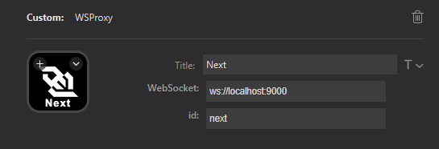

# Stream Questions Overlay App

This is a quick godot project to create an OBS Overlay for the Questions queue.

## Requirements

* Windows 10/11
* Streamdeck Websocket Plugin - https://apps.elgato.com/plugins/org.tynsoe.streamdeck.wsproxy

## Setup

### Setting up the application

* Download application and extract it to a folder, then run `StreamQuestions.exe`
* In the main menu go to settings and put in the API Url and Key information from the questions web app.
* The Main menu can be opened or closed at any time by pressing `esc`

### Setting up streamdeck buttons

* In the StreamQuestions application, under the websocket settings copy the websocket url
* Install the Streamdeck.wsproxy plugin - https://apps.elgato.com/plugins/org.tynsoe.streamdeck.wsproxy
* Add a new WSProxy button and paste the websocket URL into the `WebSocket` field
* For the ID use on of the below WebSocket actions

## WebSocket Actions

* `next` - Plays the next question
* `replay` - Replays the last question played, if no question has been played since the application was started won't do anything.

## Authors

TeknoFire - https://github.com/teknofire/

## Credits

Developed using the Godot Engine - https://godotengine.org/license

